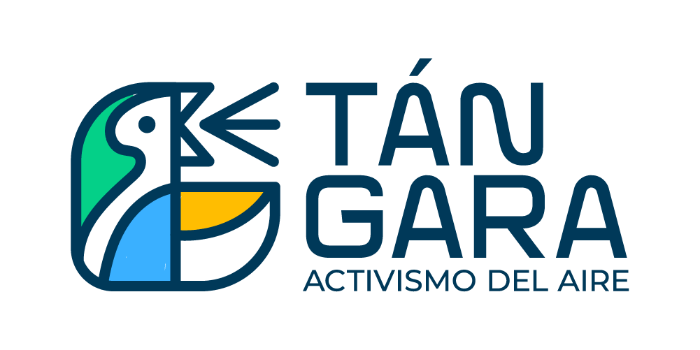

# Tangara Pipeline
Tangara Standalone Pipeline. Data sources are provided from Air Quality sensors in Cali, Colombia. https://tangara.chis.pa/

[](standalone/README.md)

## What is the Air Quality Index - AQI?
More about it: [README.md](standalone/docs/README.md)

## Análisis Día sin Carro y sin Moto - 2022
La calidad del aire de Cali no mejoró con el día sin carro y sin moto ¿Y entonces?
**[LINK](https://cali.webnoticias.co/opinion/la-calidad-del-aire-de-cali-no-mejoro-con-el-dia-sin-carro-y-sin-moto-y-entonces)**

## Análisis Día sin Carro y sin Moto - 2023
- TODO: Análisis

## Requirements

* Python 3.8+
* Poetry 1.6+
    - [Install Poetry](https://python-poetry.org/docs/#installation)

## How to use

Please read and execute each step below:

### Step 1

Install poetry by script:
```bash
$promt> bash install-poetry.sh
```

### Step 2

Activating the virtual environment:

```bash
$promt> poetry shell
```

### Optional

Deactivate the virtual environment and exit:

```bash
$(tangara-pipeline-py3.12)> exit
# To deactivate the virtual environment without leaving the shell use deactivate
$(tangara-pipeline-py3.12)> deactivate
```

## Step 3: Use Tangara Standalone Pipeline

A new standalone pipeline version was created inside the folder **standalone** please check out the [README.md](standalone/README.md) file standalone version.

---

***That's all for now ...***

---

#### License

[GPL-3.0 License](./LICENSE)
