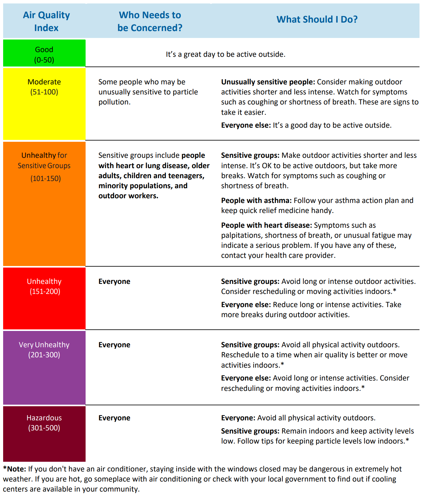
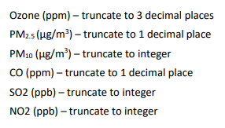
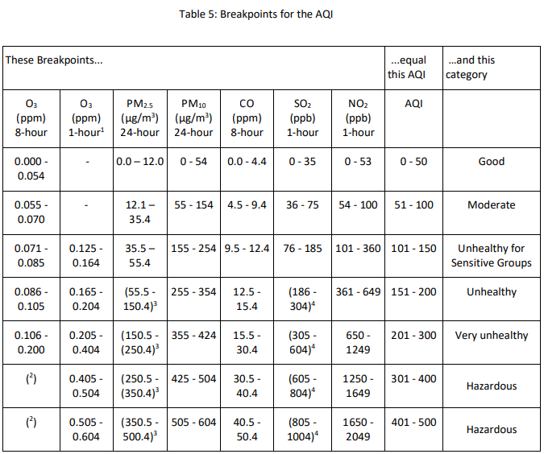
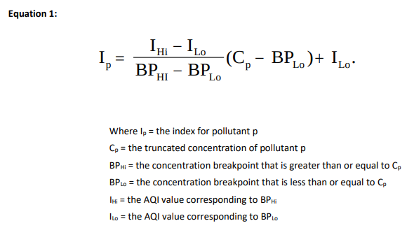

# Air Quality Index - AQI - Basics

This guide provides ways to protect your health when particle pollution reaches unhealthy levels.

## What is the U.S. Air Quality Index - AQI?

United States Environment Protection - a.k.a - EPA

The U.S. AQI is EPA’s index for reporting air quality.

### Five major pollutants
EPA establishes an AQI for five major air pollutants regulated by the Clean Air Act. Each of these pollutants has a national air quality standard set by EPA to protect public health:

- ground-level ozone
- particle pollution (also known as particulate matter, including PM2.5 and PM10)
- carbon monoxide
- sulfur dioxide
- nitrogen dioxide

### References
[AQI - Basics](https://www.airnow.gov/aqi/aqi-basics/)

[Air Quality Guide for Particle Pollution](air-quality-guide-for-particle-pollution.pdf)

[Technical Assistance Document for the Reporting of Daily Air Quality – the Air Quality Index - AQI](aqi-technical-assistance-document-sept2018.pdf)

---

### AQI Levels

### Pollutants

### Pollutants Breakpoints

---

## How do I Calculate the AQI from pollutant concentration data?

The AQI is the highest value calculated for each pollutan as follows:

    A. Identify the highest concentration among all of the monitors within each reporting area and truncate as follow:

    B. Using Table 5, find the two breakpoints tha contain the concentration.

    C. Using Equation 1, calculate the index

    D. Round the index to the nearest integer
